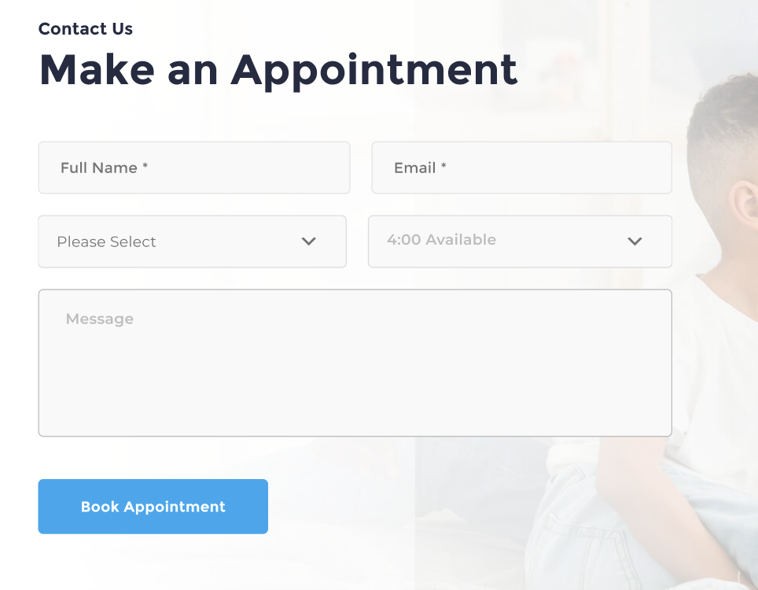
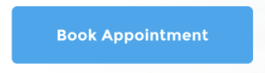
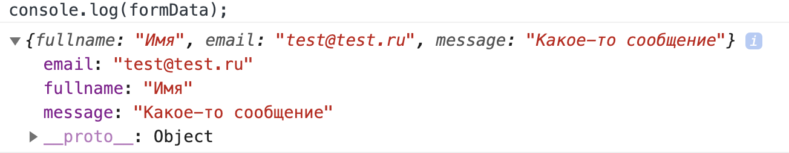
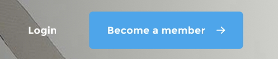
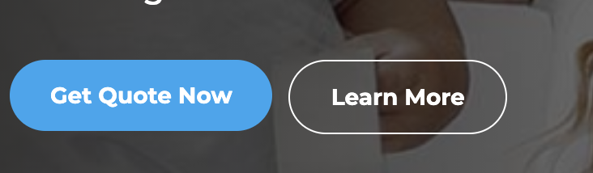
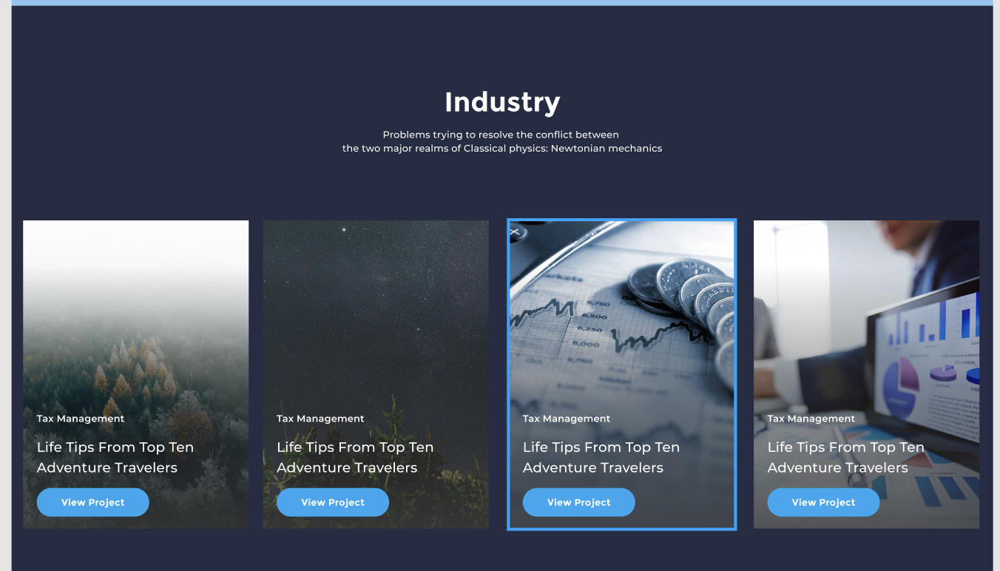

## Как работать с данным репозиторием

Необходимо посмотреть [видео](https://www.youtube.com/watch?v=5EIfStQNDD4&ab_channel=ITVDN)

Git репозиторий уже создан

Чтобы скачать данный репозиторий необходимо выполнить команду `git clone https://github.com/uporot1k/kirill_task_1`

## №1 Задание

#### Что почитать перед выполнением:
- https://learn.javascript.ru/searching-elements-dom
- https://learn.javascript.ru/introduction-browser-events#addeventlistener
- https://learn.javascript.ru/function-basics
- https://learn.javascript.ru/basic-dom-node-properties
- https://learn.javascript.ru/styles-and-classes
- https://developer.mozilla.org/en-US/docs/Web/API/Console/log

#### Описание задания

У нас есть форма 

Необходимо сделать [валидацию](https://developer.mozilla.org/ru/docs/Learn/Forms/Form_validation) формы на JS

Дизайн итоговой формы прилагается - [figma](https://www.figma.com/file/SMj8GBKQijAq2YJo869F3t/Insurantly---insurance-agency-html5-website-template-(Community)?node-id=105%3A37)

#### Как должно работать

1) Нажимаем на кнопку 
2) Если есть сообщение об успешной оплате, то нужно его скрыть
3) Должна произойти проверка в инпутах `Full Name` и `Email` на то что они не пустые. Если какой-то инпут невалидный, то должно вывестить сообщение в соответствии с дизайном + инпут окрашивается в красный цвет
4) Если поля `Full Name` и `Email` заполнены, при нажитии на кнопку должно вывестить сообщение от успешной отправке формы - [дизайн](https://www.figma.com/file/SMj8GBKQijAq2YJo869F3t/Insurantly---insurance-agency-html5-website-template-(Community)?node-id=106%3A2)
5) Форма очищается
6) В консоль браузера должно упасть сообщение вида 

## №2 Задание

#### Что почитать перед выполнением:
- https://learn.javascript.ru/position

#### Описание Задания
Требуется сделать [модальное окно](https://www.figma.com/file/SMj8GBKQijAq2YJo869F3t/Insurantly---insurance-agency-html5-website-template-(Community)?node-id=101%3A2)

#### Как должно работать 
1) При клике на Login  должно открываться модальное окно
2) При клике на черную область или крестик, модальное окно должно закрываться
3) Сделать такую же валидацию из первого задания

## №3 Задание

#### Что почитать перед выполнением:
- https://developer.mozilla.org/en-US/docs/Web/API/Element/scrollIntoView

#### Описание Задания
Кликаем на кнопку Learn More  и страница плавно прокручивается к блоку 

## Как сдавать задание

1) В файле assets/js/script.js должен лежать итоговый код для 3 заданий
2) Код необходимо закомитить и запушить в этот репозиторий через git